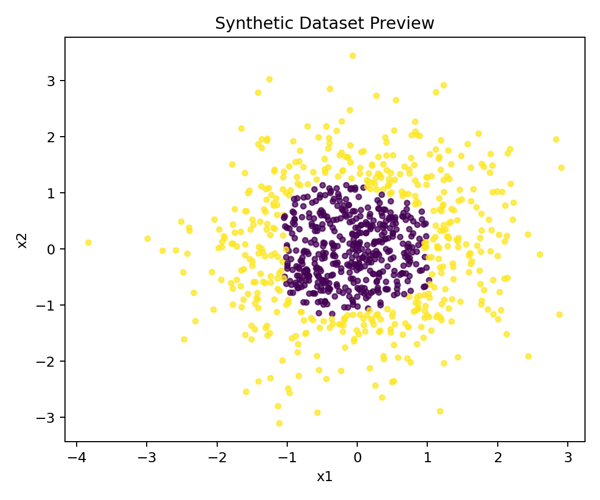
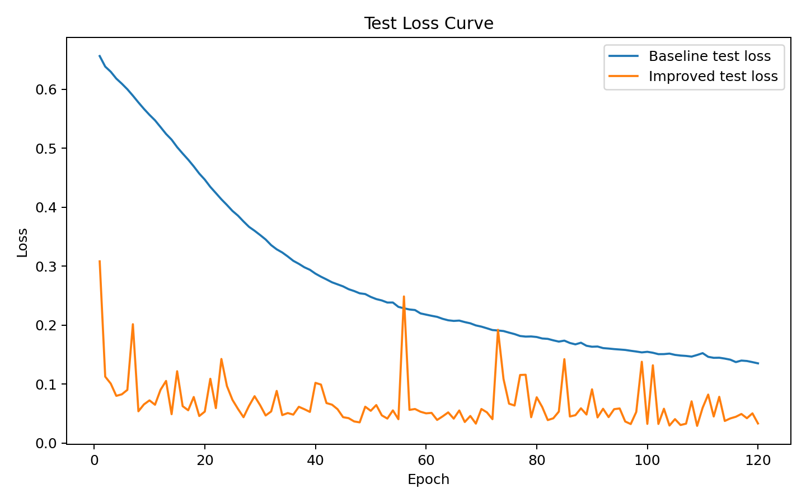
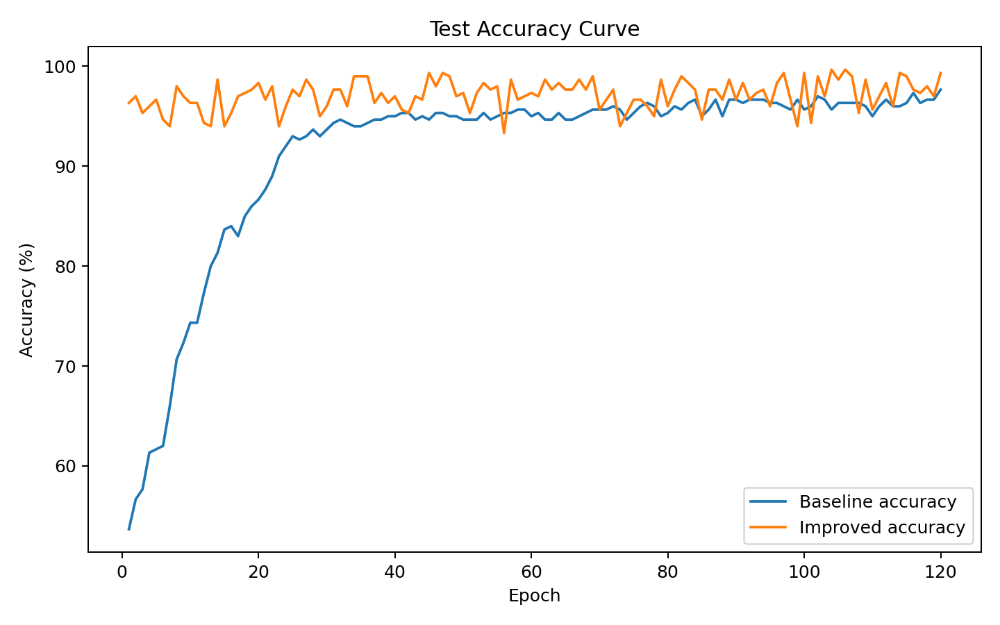
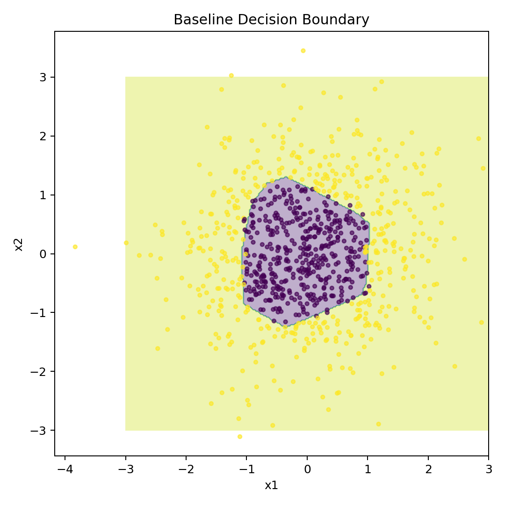
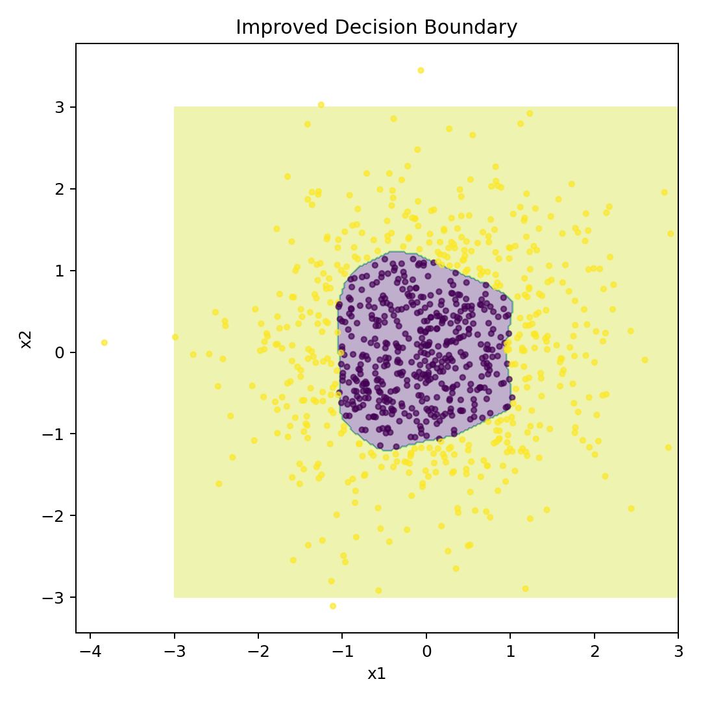
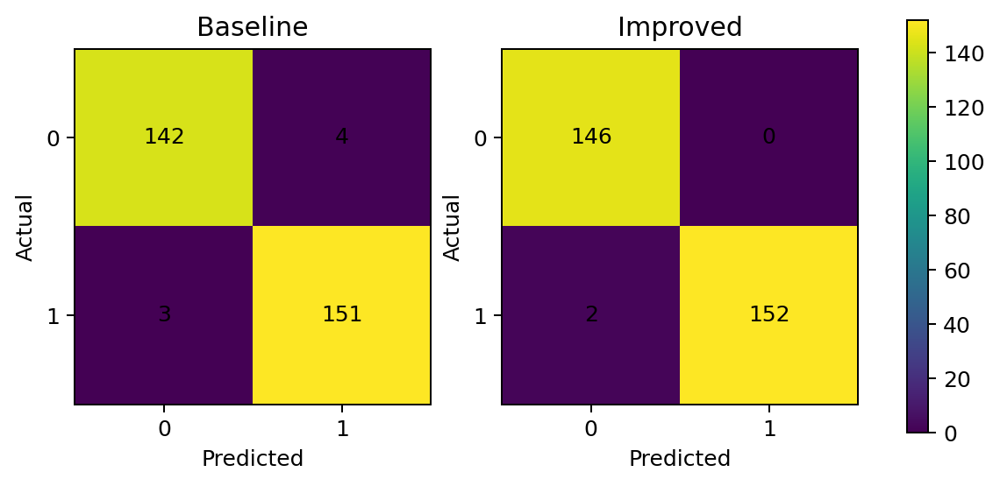

# 📘 Experiment Report: PyTorch Neural Network Comparison

## 🎯 1. Objective

This experiment compares two multilayer perceptron models on a synthetic 2D non-linear binary classification task. The goal is to observe how data preprocessing, network capacity, optimizer selection, and activation function influence training and evaluation results.

The comparison is controlled: both models use the same generated dataset, same train/test split, same evaluation metrics, and same number of training epochs.

## 🗂️ 2. Dataset

The dataset is generated inside `train_compare.py`. Each sample contains two numerical features. The class label is determined by a non-linear function that combines a radius term and sinusoidal perturbations:

- the radius term creates a circular tendency in the decision boundary;
- the sinusoidal perturbations make the boundary less regular;
- the final label is binary, represented as class `0` or class `1`.

The default configuration generates 1200 samples and uses 25% of them as the test set.



## 🧱 3. Baseline Model

The baseline model is a small multilayer perceptron:

- input dimension: 2;
- hidden layer: 1 layer with 8 hidden units;
- activation function: ReLU;
- output dimension: 2;
- loss function: CrossEntropyLoss;
- optimizer: SGD;
- learning rate: 0.05;
- trainable parameters: 42.

This model provides a simple reference point for comparison.

## 🚀 4. Improved Model

The improved model applies several changes:

- standardizes input features using training-set mean and standard deviation;
- uses 2 hidden layers instead of 1;
- increases hidden units to 32 per hidden layer;
- replaces ReLU with LeakyReLU;
- replaces SGD with Adam;
- uses a learning rate of 0.01;
- trainable parameters: 1,218.

These changes increase model capacity and make optimization more stable on this task.

## 📊 5. Result

One run with the default configuration produced the following result:

| Model | Parameters | Train loss | Test loss | Test accuracy | Method |
| --- | ---: | ---: | ---: | ---: | --- |
| Baseline | 42 | 0.1224 | 0.1354 | 97.67% | Raw features + 1 hidden layer + ReLU + SGD |
| Improved | 1,218 | 0.0238 | 0.0334 | 99.33% | Standardization + 2 hidden layers + LeakyReLU + Adam |

## 📈 6. Training Curves

| Test Loss Curve | Test Accuracy Curve |
| --- | --- |
|  |  |

The improved model converges faster and reaches lower test loss on this synthetic task.

## 🧭 7. Decision Boundary

| Baseline | Improved |
| --- | --- |
|  |  |

The improved model produces a smoother and more accurate non-linear decision boundary.

## 🔍 8. Confusion Matrix



The improved model makes fewer classification errors on the test set.

## 🧩 9. Analysis

The improvement mainly comes from four factors:

1. **Feature standardization** makes the input distribution more stable for training.
2. **Larger network capacity** helps the model fit a more complex non-linear decision boundary.
3. **Adam optimizer** provides adaptive parameter updates and converges more smoothly than plain SGD in this experiment.
4. **LeakyReLU** keeps a small gradient for negative inputs and reduces the risk of inactive neurons.

## ♻️ 10. Reproducibility

The script fixes random seeds for Python, NumPy, and PyTorch. Minor differences may still appear across different hardware, CUDA versions, PyTorch versions, and backend settings.

To reproduce the experiment:

```bash
python train_compare.py --epochs 120 --output-dir results --assets-dir assets
```

To run without figure generation:

```bash
python train_compare.py --epochs 120 --output-dir results --no-plots
```

## ⚠️ 11. Limitations

This experiment uses a synthetic dataset with a small feature dimension. It is useful for understanding a basic neural network training workflow, but it does not represent model performance on real-world data.
